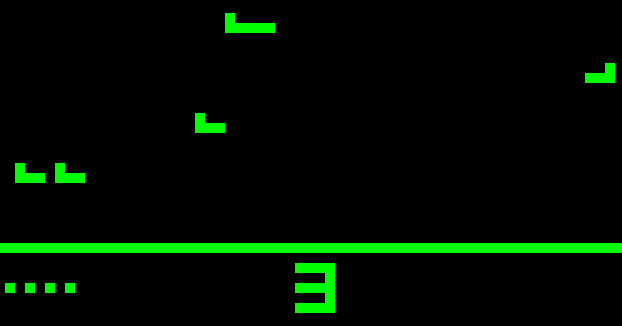

# Chip8 Emulator



Chip8 is a fictional computer architecture created in the 70s by Jospeh Weisbecker to allow video games to be more easily programmed for a diverse range of computer hardware.
Chip8 is realized in the form of a virtual machine on which ROMs either compiled, assembled or handwritten (byte by byte!) are run.
There and a huge number of such ROMs available form various sources online ([for example](https://github.com/kripod/chip8-roms)) and give the presence of a VM on the target system they can be run on almost any computer.

This repository contains my own implementation of the Chip8 VM in C++ for the Linux OS although it can likely be coerced into compiling for any OS that uses X windows.
The code was adapted from a earlier implementation I did in pure C so some evidence of this remains in the source code.
The reimplementation was mainly done as an exercise in refactoring as well as to better teach myself the X windows C library.

I've also written an assembler a disassembler for the Chip8 instruction set which you can find [here](https://github.com/xchg-rax-rax/chip8dasm).

Any comments, contributions or bug fixes would be greatly appreciated.

Enjoy!


## Compilation

For now to download and  compile the emulator for Linux use the following commands:
```{bash}
$ git clone https://github.com/xchg-rax-rax/Chip8-Emulator.git
$ cd Chip8-Emulator
$ g++ ./src/Chip8.cpp ./src/Chip8Screen.cpp ./src/emulator.cpp -o ./bin/chip8 -lX11
```

I'll add a make file and add cross platform support later down the line but for now this should work.

## Improvements

There are a couple of things I feel could be improved and which I will no doubt come back and address at a later point, likely when I am more familiar with the X windows system.

* I flush the output cache on every pixel draw, this is likely inefficient and leads to flickering as sprites are redrawn. I should refactor the screen class so that it's interface is draw\_sprite rather than draw\_pixel to prevent this.

* Collision detection doesn't work, I am unsure why. This is hard to debug without a disassembler/debugger of the Chip8 emulator it self, I should add this to the project and then use it to find the cause of the problem. 

* Timing is not optimized, this is a hard issue to deal with and is probably best solved by some sort of calibration program written in chip8 assembly.

* Some ROMs don't work, I have no idea why. It may be a format issue.

* The input implementation doesn't agree with a number of ROMs.

* Need a more extensive test suite. Currently only  the screen has any form of testing.
